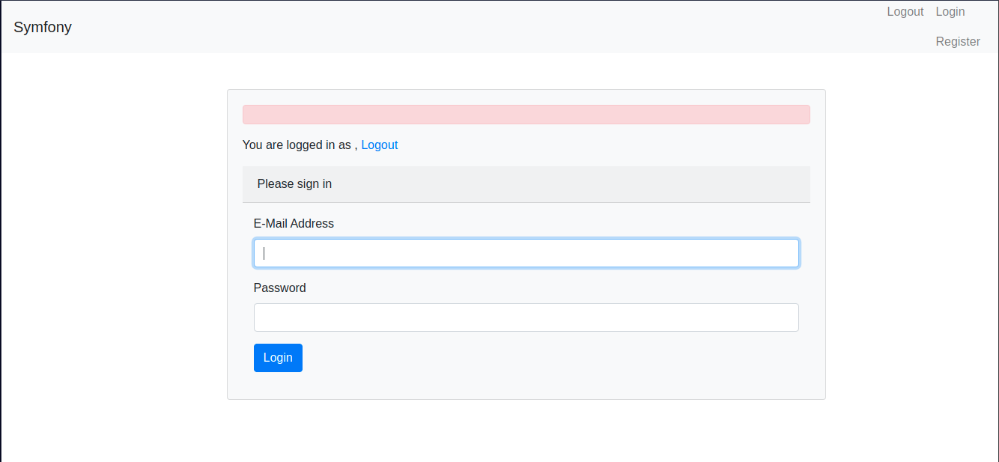
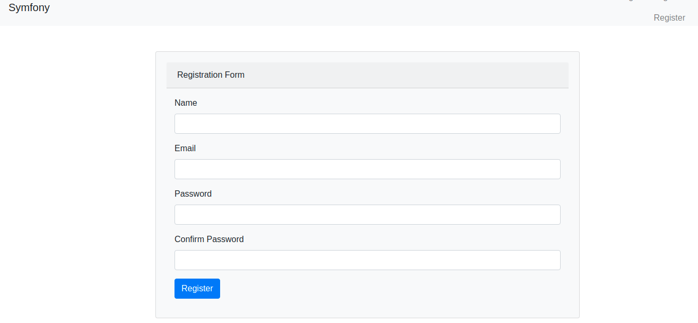
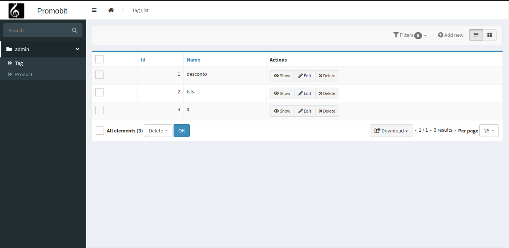

# Desafio

# Requisitos
- docker 20.x
- php 7.x
- Symfony = 4.x
- composer >= 2.1

# Instalação do projeto
- Dentro da pasta raiz executar: `docker-compose build`
- Subir o container do banco com `docker-compose up -d`
- execute: `composer install`
- forçar atualização da base: ` bin/console doctrine:schema:update --force`
- rodar o projeto: `bin/console server:run` 

# SQL
```

SELECT  t.name as 'tag name', GROUP_CONCAT(p.name SEPARATOR',' ) 'product list'
FROM tag as t
LEFT JOIN product_tag pt 
	ON t.id  = pt.tag_id 
LEFT JOIN product p 
	ON p.id = pt.product_id 
GROUP BY t.id  
 
```
# login
- se não tiver registro se cadaste no canto superior a direita:


# registro


# Admin
- CRUD Product
- CRUD Tag
- clicando em dowload na listagem de Tag, e retornado o relatorio

